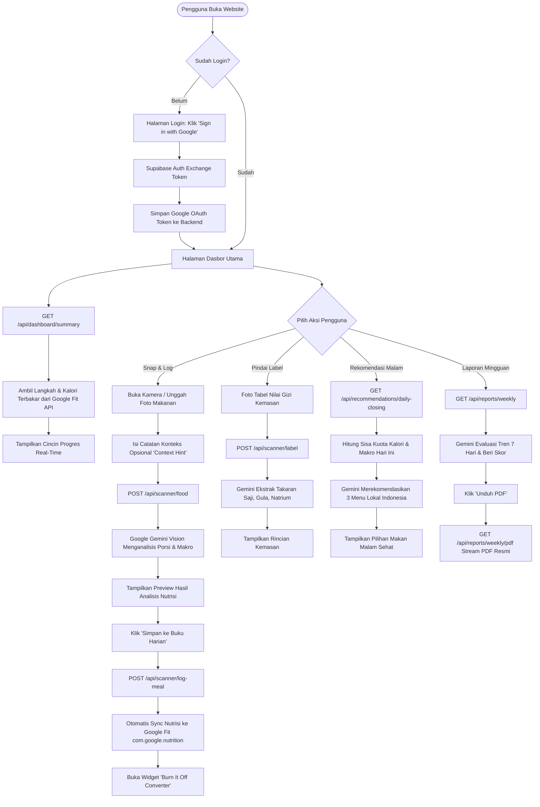
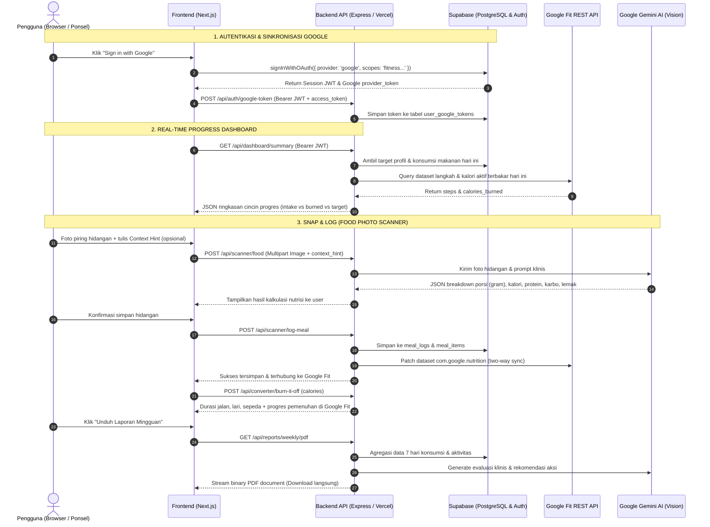

# 🗺️ Alur Kerja Sistem & Desain Alur Website CalorieKnows

Dokumen ini menjelaskan alur kerja sistem menyeluruh (*end-to-end user workflow*), arsitektur komunikasi data antara Frontend, Backend, Supabase, Google Gemini AI, dan Google Fit API, serta panduan implementasi halaman antarmuka pengguna (UI/UX).

---

## 1. Diagram Alur Sistem (End-to-End Workflow)



---

## 2. Diagram Interaksi Komunikasi (Sequence Diagram)



---

## 3. Rincian Halaman & Alur Pengguna (*Screen-by-Screen User Journey*)

### Halaman 1: Login & Registrasi (Google OAuth)
- **Tampilan**:
  - Logo CalorieKnows modern dengan *glassmorphism aesthetic*.
  - Tombol utama: **"Sign in with Google"**.
  - Deskripsi singkat integrasi Google Fit dan Gemini AI.
- **Alur Teknis**:
  1. Frontend memicu login OAuth via Supabase client:
     ```javascript
     const { data, error } = await supabase.auth.signInWithOAuth({
       provider: 'google',
       options: {
         scopes: 'https://www.googleapis.com/auth/fitness.activity.read https://www.googleapis.com/auth/fitness.activity.write https://www.googleapis.com/auth/fitness.nutrition.read https://www.googleapis.com/auth/fitness.nutrition.write',
         redirectTo: window.location.origin + '/dashboard'
       }
     });
     ```
  2. Saat kembali dari Google, ambil `provider_token` dari sesi Supabase dan kirim ke backend:
     ```http
     POST /api/auth/google-token
     Authorization: Bearer <supabase_access_token>
     Body: { "access_token": session.provider_token, "refresh_token": session.provider_refresh_token }
     ```

---

### Halaman 2: Dasbor Utama (Main Dashboard)
- **Tampilan**:
  - **Cincin Progres Kalori Real-Time (Calorie Ring)**:
    - Kalori Masuk (dari makanan di Supabase)
    - Kalori Terbakar Aktif (live dari Google Fit API)
    - Target Kalori Harian
    - Sisa Kuota Kalori Hari Ini
  - **Cincin Makronutrisi**: Bar progres Protein, Karbohidrat, dan Lemak.
  - **Widget Langkah Kaki Google Fit**: Indikator langkah hari ini (misal: 7.420 / 10.000 langkah).
  - **Timeline Makanan Hari Ini**: Daftar kartu makanan sarapan, makan siang, makan malam, dan camilan.
  - **Banner Rekomendasi Menu Malam**: Otomatis muncul di sore/malam hari jika kuota kalori belum terpenuhi.
- **Endpoint yang Digunakan**:
  - `GET /api/dashboard/summary`

---

### Halaman 3: Pemindai Makanan Cerdas (Snap & Log)
- **Tampilan**:
  - Jendela pratinjau kamera ponsel / pengunggah foto.
  - **Kolom Input Opsional (Context Hint)**:
    - *Placeholder*: *"Contoh: Dada ayam tanpa kulit, dimasak dengan sedikit minyak zaitun, es teh manis tanpa gula."*
  - Tombol **"Analisis Makanan dengan Gemini AI"**.
  - **Pop-up Hasil Analisis**:
    - Nama Hidangan utama.
    - Total Kalori & Makronutrisi (Protein, Karbo, Lemak, Serat, Natrium).
    - Daftar rincian komponen (misal: Nasi putih 150g, Ayam bakar 150g, Sambal 20g).
    - Nilai keyakinan AI (*confidence score*).
  - Tombol **"Simpan & Catat Makanan"**.
- **Endpoints yang Digunakan**:
  - `POST /api/scanner/food` (Kirim foto + `context_hint`)
  - `POST /api/scanner/log-meal` (Simpan hidangan terverifikasi & sync Google Fit)

---

### Halaman 4: Pemindai Label Nilai Gizi Kemasan (Nutrition Label Scanner)
- **Tampilan**:
  - Mode pemindai khusus untuk memotret tabel Informasi Nilai Gizi di belakang kemasan biskuit, susu, atau minuman kaleng.
  - **Hasil Ekstraksi Gemini AI**:
    - Takaran Saji & Jumlah Sajian per Kemasan.
    - Kalori per sajian vs Kalori total satu kemasan penuh.
    - Kandungan gula, lemak jenuh, dan kadar natrium (disertai indikator warna: Hijau/Aman, Kuning/Waspada, Merah/Tinggi Gula atau Garam).
- **Endpoint yang Digunakan**:
  - `POST /api/scanner/label`

---

### Halaman 5: Widget Konverter Aktivitas (Burn It Off Converter)
- **Tampilan**:
  - Muncul langsung setelah pengguna mencatat makanan atau diakses melalui riwayat makanan.
  - Menjawab pertanyaan: *"Berapa lama olahraga yang saya butuhkan untuk membakar hidangan ini?"*
  - **Kartu Pilihan Aktivitas (Berdasarkan MET Ilmiah)**:
    - 🚶 Jalan Santai: `X menit`
    - 🏃 Jogging: `Y menit`
    - 🚴 Bersepeda: `Z menit`
    - 🪢 Lompat Tali: `N menit`
    - 🏊 Berenang: `M menit`
  - **Koneksi Google Fit**: Menampilkan berapa persen kalori makanan tersebut yang *sudah otomatis terbakar* oleh aktivitas fisik pengguna hari ini.
- **Endpoint yang Digunakan**:
  - `POST /api/converter/burn-it-off` (Kirim `meal_id` atau jumlah `calories`)

---

### Halaman 6: Rekomendasi Menu Penutup Target Harian (Smart Meal Recommender)
- **Tampilan**:
  - Tombol atau tab: **"Rekomendasi Menu Malam"**.
  - Menampilkan 3 kartu hidangan lokal nusantara/sehat pilihan Gemini AI yang disesuaikan secara presisi dengan sisa kalori dan protein yang belum terpenuhi.
  - Setiap kartu memuat:
    - Nama hidangan (contoh: Pepes Tahu Jamur + Sup Dada Ayam).
    - Total kalori dan makronutrisi.
    - Rincian bahan dan tips memasak sehat tanpa minyak berlebih.
- **Endpoint yang Digunakan**:
  - `GET /api/recommendations/daily-closing?meal_type=dinner`

---

### Halaman 7: Laporan Mingguan & Ekspor PDF (Weekly Nutrition Report)
- **Tampilan**:
  - Grafik tren konsumsi makanan vs kalori aktif terbakar selama 7 hari terakhir.
  - Kartu Evaluasi AI: Skor Kesehatan (Grade A/B/C) dan ringkasan klinis oleh Gemini.
  - Daftar pencapaian dan area perbaikan gizi.
  - Tombol **"Download Laporan PDF Resmi"**.
- **Alur Teknis Download PDF**:
  - Pengguna mengklik tombol unduh, frontend memanggil endpoint `GET /api/reports/weekly/pdf` dengan header `Authorization: Bearer <token>`.
  - Backend langsung men-*stream* binary PDF secara instan untuk langsung disimpan atau dicetak pengguna.
- **Endpoints yang Digunakan**:
  - `GET /api/reports/weekly` (Tampilan data di layar)
  - `GET /api/reports/weekly/pdf` (Unduh berkas PDF)
